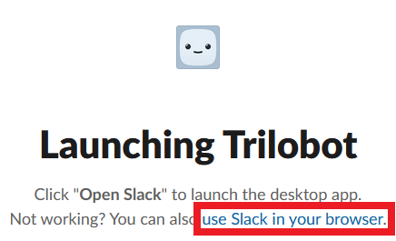

# LAClient

> An Electron-based Slack wrapper with auto-refresh and audio notifications for 2U Learning Assistants

Inspired by [AskAssist](https://github.com/Noxid86/AskAssist), LAClient aims to be an all-in-one Slack wrapper for 2U
Learning Assistants that provides features such as automatic queue refreshing, audio notifications, and more to come.

 

## Table of Contents

* [Planned Features](#planned-features)
* [Installation](#installation)
* [First Time Setup](#first-time-setup)
* [Usage](#usage)
* [Contributing](#contributing)

 

## Planned Features

Below you may find a list of features that are planned for LAClient that have yet to be implemented:

* ~~Desktop Notifications~~
* Audio/Desktop alert if an error occurs during an automatic refresh (e.g. AskBCS and/or Slack goes down)
* Automatic application updating via Electron and GitHub Releases
* Caching audio files, so they are not required to remain present on the hard drive
* Bug fixes as they are reported, as usual

 

## Installation

To install LAClient, you will first need to be running a suitable operating system. At the time of writing, LAClient is
built against Linux (via `.AppImage`), Mac OSX (via `.dmg`), and Windows (via `.exe`).

First, download the latest version of LAClient for your OS by visiting
the [releases](https://github.com/jcoon97/LAClient/releases) page, and then execute the file. Once the package has been
installed on your machine, it *should* automatically open LAClient; however, if it does not automatically open the
application, then you can search for "LAClient" on your host machine and open it from there, e.g. using KRunner or
similar on Linux, Launchpad on Mac OSX, or Search on Windows.

 

## First Time Setup

Once the application has been downloaded and installed, when you first open it, you will be prompted to log in to
Trilobot's workspace. You may use the same credentials that you would use if logging in via Slack's website in your
favorite web browser or via Slack's Desktop application.

When you log in, Slack may automatically open its own Desktop application and bring it to the foreground. In this case,
you can close out of Slack's Desktop application and transfer back over to LAClient. Once back on LAClient, you can then
click on "use Slack in your browser."

  

    

 

## Usage

By default, when you run the application for the first time, the following default preferences will be used:

* Auto-Refresh
    * Enabled (`boolean`: `true`) — When checked, if you are on the AskBCS Learning Assistant page on Slack, LAClient
      will automatically refresh the queue at the specified interval below.
    * Refresh Interval (`number`: `15`) — Specifies the amount of time (in seconds) that must elapse between each
      automatic refresh, if this setting is enabled via the previous preference value.
* Audio Notification
    * Enabled (`boolean`: `false`) — When checked, if any question(s) are found in the AskBCS queue due to an automatic
      refresh, an audio file (specified below) will be played through your speakers.
    * Audio File (`string`: `null`) — Specifies the absolute path to the audio file on your PC that you would like to be
      played when a question is found in the AskBCS queue.
    * Timeout (`number`: `30`) — Specifies the amount of time (in seconds) that must elapse before a notification can be
      played again, if one has already recently played. If you would only like one notification to play per minute, then
      this value should be set to `60`.
    * Playback Volume (`number`: `0.5`) — Specifies the volume this notification will play at. The range slider goes from
      0.0 (silent) to 1.0 (the loudest).

Please see the following for some notes regarding LAClient and its usage:

* You must be present in the AskBCS queue for it to automatically refresh. If you switch to another channel, public or
  private, this functionality will halt until you return to the AskBCS Learning Assistant app on Slack.
* Since Electron is a wrapper for Chromium, currently, there are only 3 supported audio files that may be used: `mp3`,
  `m4a`/`mp4`, and `ogg`. Unfortunately, at the time of writing, `wav` files are not supported in LAClient.
* Since audio files are played by reading the data using an absolute path on your PC, the selected audio file must
  remain present on your PC at the exact location for future use. There are plans to cache audio files so this is not
  necessary, but that feature has yet to be implemented.
* If you would like to reset your preferences to the default values defined above, please click on "Reset Preferences."
  Additionally, if you would like to test that an audio file is working, click on "Test Notification."

 

## Contributing

If you would like to contribute to the development of LAClient, feel free to fork this repository and submit a pull
request (PR). Although there are no specific requirements for contributing to LAClient, any PRs submitted that do not
contain statically-typed code (using TypeScript) will be not be approved until they are modified to do so.
